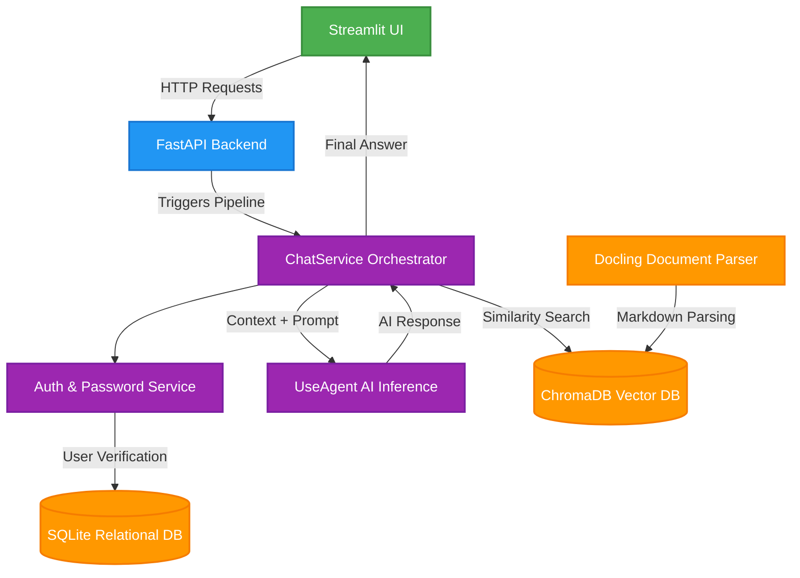

# Vektor-RAG: Production-Ready Native RAG System

A comprehensive, production-ready Native Retrieval-Augmented Generation (RAG) system built from scratch. This project demonstrates enterprise-level software engineering principles, moving beyond basic scripting into structured system architecture, multi-database management, and clean modular design.

> **Engineer's Note:** The core challenge of modern AI Engineering is not writing the code itself—which frameworks make accessible—but mastering **system thinking, scalable infrastructure, and robust pipeline orchestration**. This project was built to explore and solve those architectural complexities.

---

## 🏗️ System Architecture & Infrastructure

The application separates concerns across clear modular layers, managing relational user data, isolated security domains, high-performance vector operations, and decoupled frontend/backend communication.
### 🗄️ Database Layer

The system implements a **Dual-Database Strategy** to decouple structured relational state from high-dimensional vector memory.

#### 1. Relational Database (SQLite)
Handles persistent storage for user management, session states, and system memory.
*   `DatabaseInitializer.py`: Automates zero-configuration deployment by scaffolding tables and relationships on the first system boot.
*   `SQLConnection.py`: Manages centralized connection pools and lifecycle states for the relational backend.
*   `DAO.py` (Data Access Object): Implements the strict CRUD pattern, abstracts raw SQL queries into clean Python methods (e.g., `NewUser()`), and protects against injection.

#### 2. Vector Database Engine (ChromaDB)
The core knowledge retrieval pipeline of the RAG system, managing ingestion and semantic searches.
*   `DocumentProcessor.py`: Ingests raw PDFs and parses them into standardized Markdown formats for optimized data loading.
*   `Embedding_service.py`: Orchestrates the embedding pipelines using localized/cloud models via LangChain.
*   `vector_db.py`: Direct interface with **ChromaDB** to index generated high-dimensional embedding vectors.
*   `Searcher.py`: Executes highly optimized similarity searches targeting a threshold of `top_k=3` most relevant contexts.
*   `System.py`: Manages the raw parsed markdown documents on the local filesystem.

---

## 🛠️ Application Services & Orchestration

### 🔐 Authentication & Security Domain
*   `PasswordService.py`: Enforces zero-knowledge security protocols by securely hashing and verifying raw passwords during login and registration.
*   `AuthService.py`: Implements validation boundaries, credential checks, and structural identity rules.

### 🧠 Core Orchestration
*   `ChatService.py`: Actively functions as the **System Orchestrator**. It sits in the center of the pipeline, binding database lookups, security states, semantic contexts, and model calls into a single synchronous flow.

### 🤖 Intelligent Agent Layer
*   `UseAgent.py`: Dedicated strictly to model inference, output generation, and response engineering. *Refactored from an monolithic class into a single-responsibility module focused entirely on AI communication.*

---

## 🌐 API & User Interface

### ⚡ Backend API (FastAPI)
*   `Backend.py`: Exposes five clean RESTful HTTP endpoints coordinating frontend demands with backend services. Chosen for its performance, type safety, and operational simplicity compared to Flask or Django.

### 🎨 Frontend (Streamlit)
*   Refactored from heavy desktop GUI designs (PyQt) into a lightweight, reactive **Streamlit** dashboard. Built entirely in Python, delivering a clean, web-native chat experience with minimal boilerplate.

---

## 📊 Domain Models & Diagnostics

*   **Data Models:** Pure, state-agnostic Python dataclasses (`chat.py`, `person.py`, `message.py`, `metadata.py`) enforce type-safety across all application layers without business logic side-effects.
*   **Error Handling:** Features custom exceptions tailored to critical pipeline failures. Future iterations aim to structurally scale these error barriers to achieve defensive fault-tolerance across every module.
